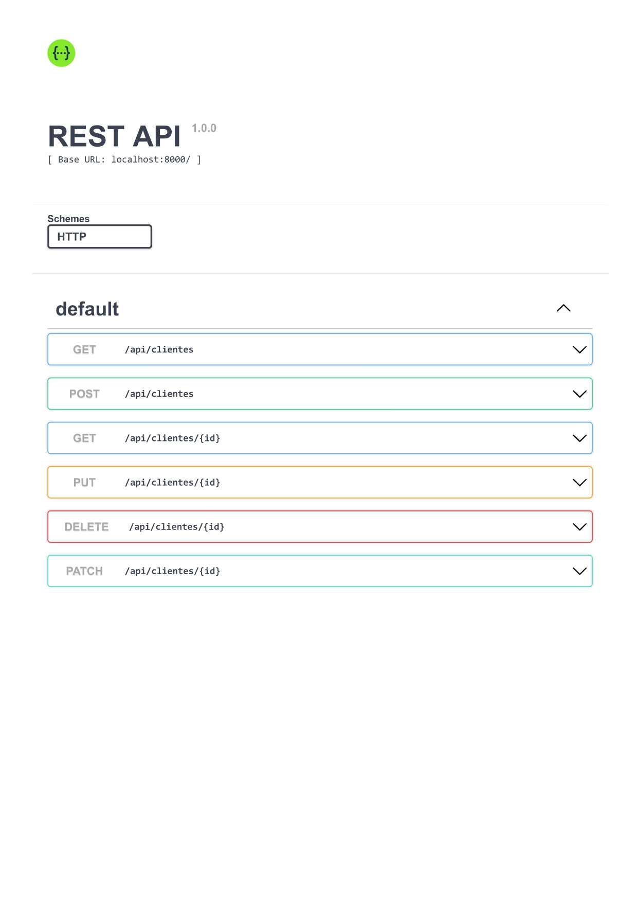

# Projeto Api CRUD - MySQL

## Iniciar projeto
 - Primeiro baixe as dependência
 
 ```bash
  npm install
  #or
  yarn
 ```

 - Depois é so iniciar

 ```bash
  npm run start
  #or
  yarn start
 ```

## Rotas

<div style="height:500px" align="center">
  
</div>

## Pacotes usados - 
 - mysql2
 - express
 - nodemon
 - eslint
 - Swagger